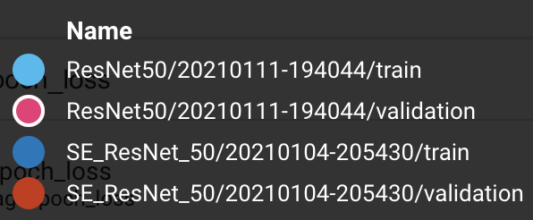
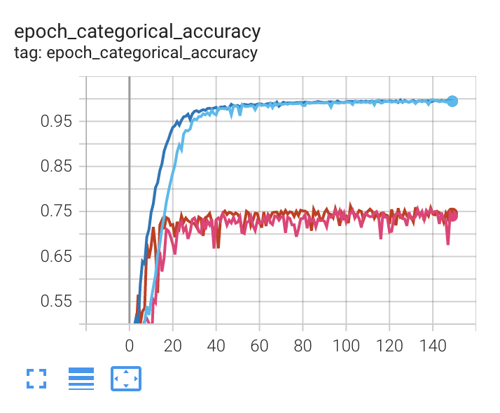
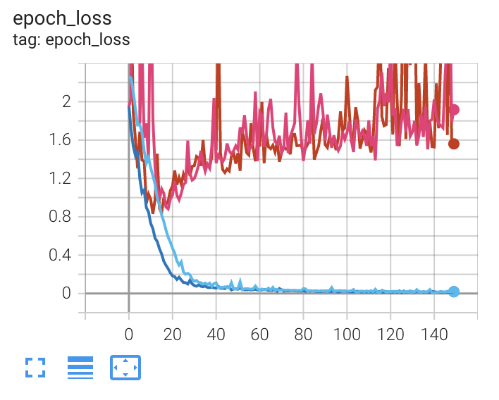

# SENet

- TensorFlow implementation for SENet, [`Squeeze-and-Excitation Networks`](https://arxiv.org/abs/1709.01507);
- Some benchmark experiments are attached.

Due to there is no implementation by TensorFlow 2.x (the official code [2] uses Caffe), I implement SENet with TensorFlow on my own. The `Keras-Applications` repository is utilized. Feel free to contact with me [Kan Huang](https://ai-huang.github.io/) ([mailto:kanhuang](mailto:kan.huang@connect.ust.hk)) for questions on how to use and suggestions on the implementation.

SENet is a initial work on Attention-like mechanism effecting on computer vision models. The design of the visual network operator is also pretty micro and very suitable for CVers and NLPers to dig in.

## Installation and usage

Clone this repository

```bash
git clone https://github.com/AI-Huang/SENet
```

and install

```bash
cd SENet
python setup.py install
```

The module is installed calling `senet` as in `setup.py`. Using example:

```Python
from senet.keras_fn.se_resnet import SE_ResNet_18
```

## SENet family

| model           | based on | in original paper |
| --------------- | -------- | ----------------- |
| SE-BN-Inception | -------- | Y                 |
| SE-ResNet-18    | ResNet   | N                 |
| SE-ResNet-50    | ResNet   | Y                 |
| SE-ResNet-101   | ResNet   | N                 |
| SE-ResNet-152   | ResNet   | Y                 |
| SE-ResNeXt-50   | ResNeXt  | Y                 |
| SE-ResNeXt-101  | ResNeXt  | Y                 |
| SENet-154       | -------- | Y                 |

## Benchmarks

### Cifar-10







Our benchmark experiment on Cifar-10 shows that the ResNet50 networks with and w/o SE module result in almost the same final accuracy and loss. However, the ResNet50 network with the SE module can converge faster w.r.t. both the accuracy and the loss. This illustrate the Attention effect on boosting training.

## References

- [1] J. Hu, et al., Squeeze-and-Excitation Networks, [https://arxiv.org/abs/1709.01507](https://arxiv.org/abs/1709.01507)
- [2] Official Code (Caffe), [https://github.com/hujie-frank/senet](https://github.com/hujie-frank/SENet)
